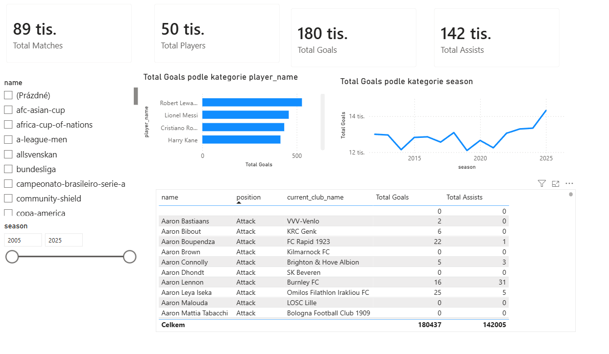

# ⚽ Football Data Analytics & Power BI Dashboard

Kompletní end-to-end projekt zaměřený na zpracování, relační modelování a analýzu fotbalových dat z evropských lig s interaktivním dashboardem v Power BI.

---

## 📌 1. Cíl projektu
Cílem projektu bylo:
* Navrhnout a implementovat relační databázové schéma v **PostgreSQL**.
* Zpracovat a načíst rozsáhlá data (přes 1,8 milionu záznamů) z reálného prostředí evropského fotbalu.
* Provést sérii 20 analytických dotazů (SQL) zkoumajících efektivitu hráčů, týmové výkony a finanční tržní hodnoty.
* Vytvořit interaktivní analytický dashboard v **Power BI** s podporou filtrů a vlastních DAX měřítek.

---

## 🛠️ 2. Použité technologie
* **Databáze:** PostgreSQL 17
* **Správa databáze & IDE:** JetBrains DataGrip
* **Business Intelligence / Vizualizace:** Power BI Desktop (DAX)
* **Verzování & Dokumentace:** Git & GitHub

---

## 🗄️ 3. Datový model a struktura databáze

Projekt využívá hvězdicové schéma (*Star Schema*) s centrální tabulkou faktů a čtyřmi dimenzemi:
[public_competitions] ─── (1:N) ───┐
▼
[public_clubs] ── (1:N) ──> [public_players] ── (1:N) ──> [public_appearances] (FAKTOVÁ TABULKA)
▲
[public_games] ─────────────────── (1:N) ────────────────────────┘
### Přehled entit v databázi:
* **`competitions`**: Číselník fotbalových lig a soutěží (65 záznamů).
* **`clubs`**: Informace o klubech, stadionech a tržní hodnotě (796 záznamů).
* **`players`**: Detailní údaje o hráčích, pozicích a občanství (50 149 záznamů).
* **`games`**: Zápasová historie s výsledky a návštěvností (88 958 zápasů).
* **`appearances`**: Individuální statistiky hráčů na zápas – góly, asistence, minuty, karty (1 894 350 řádků).

---

## 🔍 4. Ukázky klíčových SQL analýz

### A) Nejlepší efektivita: Góly na 90 minut (min. 1 000 odehraných minut)
```sql
SELECT 
    player_name, 
    SUM(goals) AS total_goals,
    SUM(minutes_played) AS total_minutes,
    ROUND((SUM(goals)::NUMERIC / (SUM(minutes_played)::NUMERIC / 90)), 2) AS goals_per_90
FROM appearances
GROUP BY player_name
HAVING SUM(minutes_played) >= 1000
ORDER BY goals_per_90 DESC
LIMIT 10;

### B) Domácí dominance týmů (Výhernost doma)
SQL
SELECT 
    home_club_name,
    COUNT(*) AS total_home_games,
    SUM(CASE WHEN home_club_goals > away_club_goals THEN 1 ELSE 0 END) AS home_wins,
    ROUND(
        (SUM(CASE WHEN home_club_goals > away_club_goals THEN 1 ELSE 0 END)::NUMERIC / COUNT(*)) * 100, 2
    ) AS home_win_percentage
FROM games
GROUP BY home_club_name
HAVING COUNT(*) >= 30
ORDER BY home_win_percentage DESC
LIMIT 10;

(Všech 20 dotazů je dostupných ve složce /sql/02_analysis_queries.sql).

📊 5. Power BI Dashboard
Ukázka interaktivního reportu vytvořeného v Power BI:

Klíčové prvky dashboardu:
KPI Karty: Celkový počet gólů, asistencí, odehraných zápasů a unikátních hráčů.

Filtry (Slicers): Možnost dynamického filtrování podle vybrané ligy a konkrétní sezóny.

TOP 10 Střelců: Pruhový graf zobrazující nejproduktivnější zakončovatele.

Vývoj v čase: Spojnicový graf vývoje počtu gólů napříč sezónami.

Detailní tabulka: Přehled hráčů s jejich pozicí, aktuálním klubem a součtem odehraných statistik.

💡 6. Hlavní zjištění (Key Insights)
Efektivita na 90 minut: Celkový počet gólů často zvýhodňuje hráče s delší kariérou, zatímco metrika Goals per 90 odhaluje reálnou okamžitou efektivitu útočníků.

Výhoda domácího prostředí: Týmy vykazují v průměru o více než 15–20 % vyšší úspěšnost výher na domácím hřišti oproti zápasům venku.

Distribuce tržní hodnoty: Nejvyšší průměrnou tržní hodnotu mají střední a křídelní útočníci, což odpovídá trendu globálního přestupového trhu.
